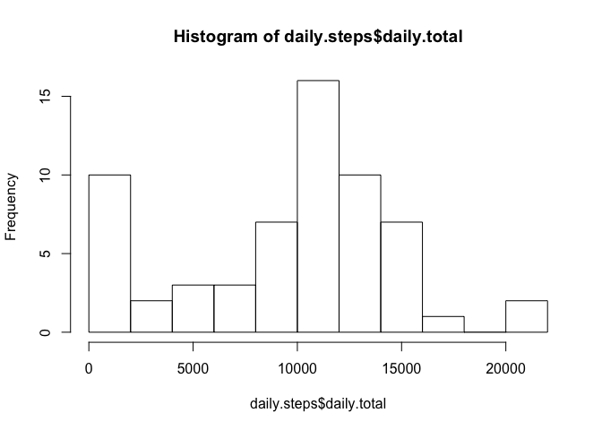
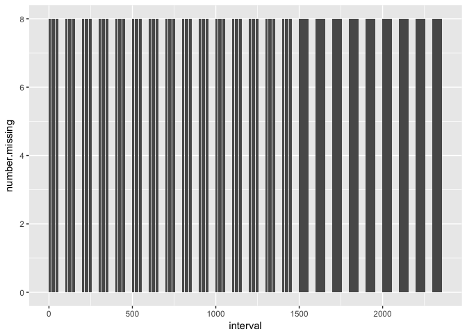
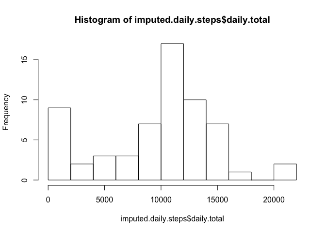
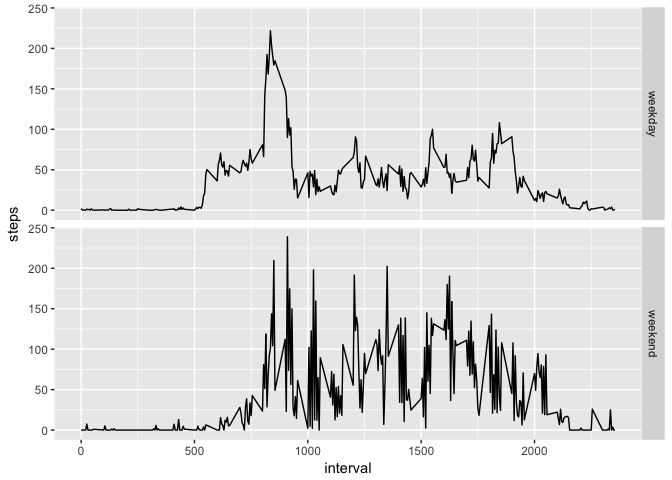

## Loading and preprocessing the data
Import the data file and convert the date to the right format.

```r
setwd("/Users/mnoetel/Documents/GitHub/RepData_PeerAssessment1")
d <- read.csv("activity.csv")
d$date <- as.Date(d$date)
```

```
## Warning in strptime(xx, f <- "%Y-%m-%d", tz = "GMT"): unknown timezone
## 'zone/tz/2017c.1.0/zoneinfo/Australia/Sydney'
```

## Mean Daily Steps
First lets explore the pattern of the data with a histogram of the total number of steps taken each day


```r
require(dplyr)
```

```
## Loading required package: dplyr
```

```
## 
## Attaching package: 'dplyr'
```

```
## The following objects are masked from 'package:stats':
## 
##     filter, lag
```

```
## The following objects are masked from 'package:base':
## 
##     intersect, setdiff, setequal, union
```

```r
d %>% group_by(date) %>% summarise(daily.total = sum(steps, na.rm = TRUE)) -> daily.steps
hist(daily.steps$daily.total, breaks = 15)
```

<!-- -->

Our participant here seems to take around 10,000 steps on most days, meeting the recommended daily requirements

#Mean and median daily steps

```r
summary.stats <- summary(daily.steps$daily.total)
summary.stats
```

```
##    Min. 1st Qu.  Median    Mean 3rd Qu.    Max. 
##       0    6778   10400    9354   12810   21190
```

The participant takes 9354 steps per day, on average. The median is 1.04\times 10^{4}.

## Average daily activity pattern
To explore the pattern of the data, let's look at the time series plot of the average number of steps taken


```r
require(ggplot2)
```

```
## Loading required package: ggplot2
```

```r
ggplot(data = d, aes(interval, steps), na.action(na.omit)) +
        stat_summary(fun.y = "mean", geom = "line")
```

```
## Warning: Removed 2304 rows containing non-finite values (stat_summary).
```

<!-- -->

There's a spike in daily steps between interval 500 and 1,000. Let's look at this interval, which appers to be the 5-minute interval that, on average, contains the maximum number of steps


```r
d %>% group_by(interval) %>%
        summarise(interval.average = mean(steps, na.rm = TRUE)) ->
        interval.steps
interval.max <- interval.steps$interval[which(interval.steps$interval.average ==
              max(interval.steps$interval.average))]
```

The biggest number of steps in a five-minute interval is approximately 206.1698113 at interval 835

## Imputing missing values
Before imputing missing values, let's take a look at the pattern of missing data. Missingness is only present in the Steps variable:

```r
d %>% group_by(interval) %>%
        summarise(number.missing = sum(is.na(steps))) ->
        missing.pattern
ggplot(data = missing.pattern, aes(interval, number.missing)) +
        geom_col()
```

<!-- -->

A fairly random series of intervals has missing data, and there are 8 missing points at each. As recommended in assignment description, use the mean for that 5-minute interval and put it into a new data frame, imputed.


```r
imputed <- d
imputed[is.na(imputed$steps),1] <-
        interval.steps[is.na(imputed$steps),2]
```

#Imputed data
Lets take a look at the pattern of total daily steps from before using the missing data


```r
imputed %>% group_by(date) %>% summarise(daily.total = sum(steps, na.rm = TRUE)) ->
        imputed.daily.steps
hist(imputed.daily.steps$daily.total, breaks = 15)
```

<!-- -->

And lets look at the mean and median to see if these measures of central tendency have changed.


```r
imputed %>% group_by(date) %>% summarise(daily.total = sum(steps, na.rm = TRUE)) -> daily.steps.imputed
summary.stats.imputed <- summary(daily.steps.imputed$daily.total)
summary.stats.imputed
```

```
##    Min. 1st Qu.  Median    Mean 3rd Qu.    Max. 
##       0    7047   10440    9531   12810   21190
```

Imputing the missing values using the mean has a minimal impact on the measures of central tendency: the mean goes from 9354 to 9531; the median goes from 1.04\times 10^{4} to 1.044\times 10^{4}.

## Weekdays vs. Weekends
Lets use the weekdays() function with filled data to create a factor with two levels: “weekday” and “weekend.”

```r
weekend <- c("Saturday", "Sunday")
imputed$weekday <- as.character(NA)
imputed$weekday[weekdays(imputed$date) != weekend] <- "weekday"
imputed$weekday[weekdays(imputed$date) == weekend] <- "weekend"
imputed$weekday <- as.factor(imputed$weekday)
```

Let's take a look at a time-series plot of the average number of steps throughout the day, with separate panels for weekdays and weekends.

```r
ggplot(data = imputed, aes(interval, steps), group = weekday) +
        facet_grid(weekday ~ .) +
        stat_summary(fun.y = "mean", geom = "line")
```

```
## Warning: Removed 2016 rows containing non-finite values (stat_summary).
```

<!-- -->

Our participant might have an office job, becuase on weekdays there is activity in the morning and then less throughout the day, however on weekends there is consistent activity throughout the day.
